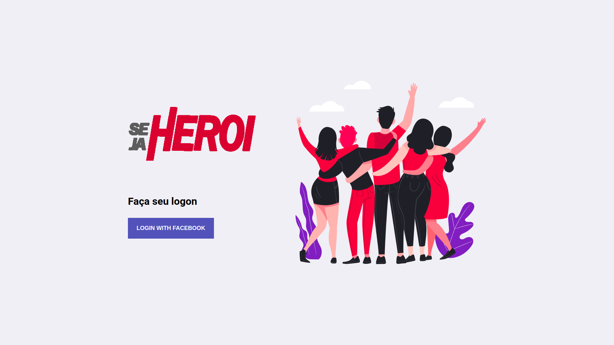
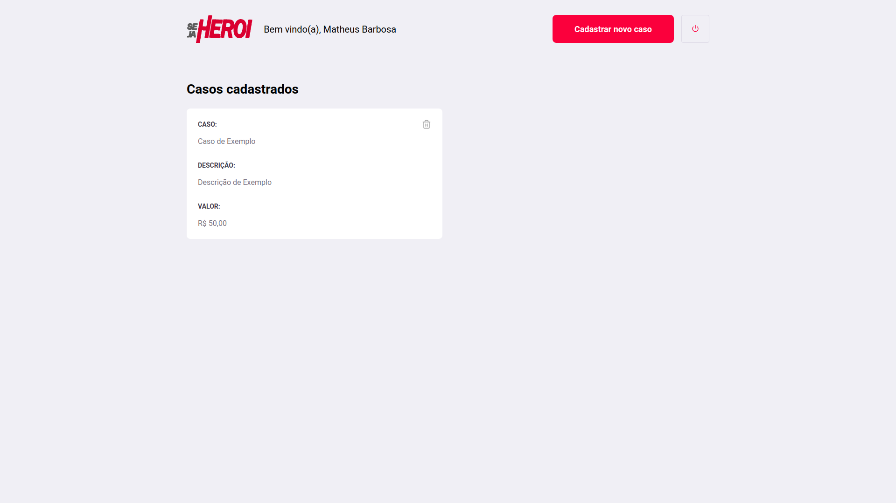
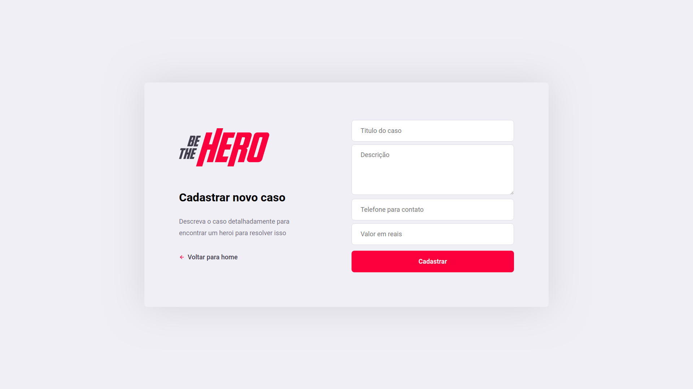
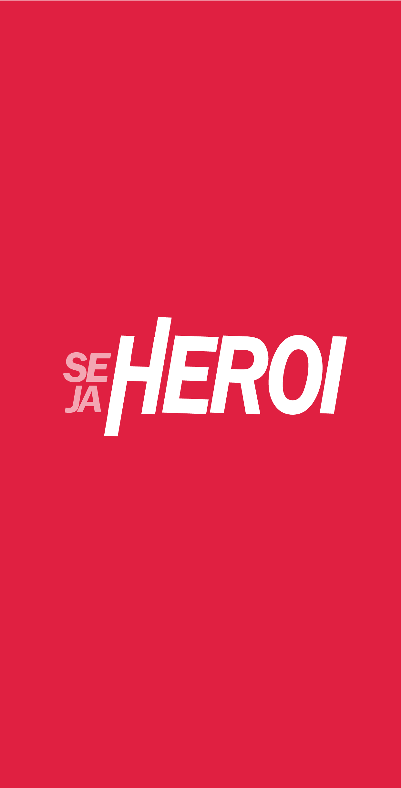
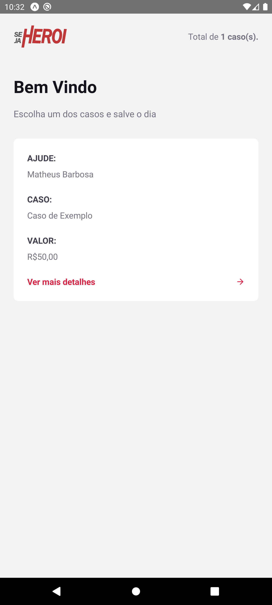
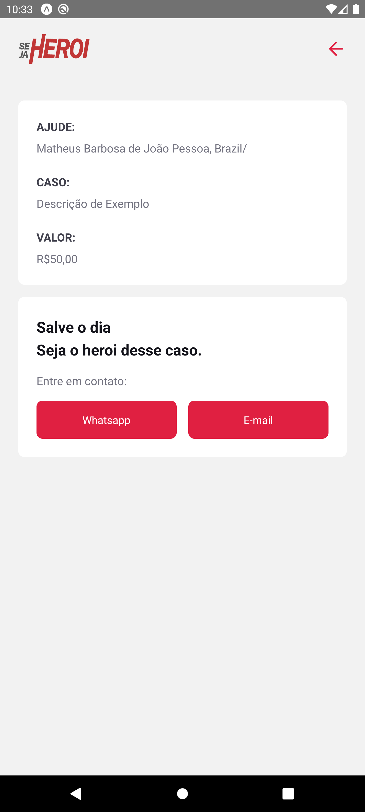

<h4 align="center">
 
 <b>Seja um verdadeiro Heroi!</b> 🦸‍♂️
</h4>

  
  

 

### :rocket: Tecnologias usadas

Este maravilindo projeto foi desenvolvido com as seguintes tecnologias:

- [Node.js](https://nodejs.org/en/)
- [Expo](https://expo.io/)
- [Express](https://expressjs.com/pt-br/)
- [ExpressJs](https://expressjs.com/pt-br/)
- [Nodemon](https://www.npmjs.com/package/nodemon)
- [Axios](https://www.npmjs.com/package/axios)
- [Cors](https://www.npmjs.com/package/cors)
- [Eslint](https://www.npmjs.com/package/eslint)
- [Jest](https://www.npmjs.com/package/jest)

### :muscle: Projeto

<b>Be the Hero</b> originalmente é um projeto que visa ajudar, de maneira <b>financeira</b> uma instituição de caridade, ajudando a mesma se manter.
**No entando, essa adaptação é destinada a ajudar no combate a pandemia do COVID-19.**

### 🦸‍♂️ Como Funciona?  

Segundo as recomendações da [OMS](https://www.who.int/eportuguese/countries/bra/pt/) as pessoas devem se manter em isolamento social e evitar ao máximo sair de suas casas. As pessoas idosas principalmente, pois estão no grupo considerado de maior risco, devem recorrer a outras pessoas para, por exemplo, ir ao supermercado.

Esse projeto disponibiliza uma versão “web” onde as pessoas podem cadastrar as suas necessidades e uma versão mobile onde outras pessoas podem ter acesso aos casos cadastrados e escolher um ou mais casos para ajudar.

##### Versão WEB: https://sejaheroi.netlify.app/

screenshots

    
    
    

##### Versão MOBILE: https://exp.host/@barbosamaatheus/bethehero

screenshots

    
    
    

### :recycle: Como contribuir

- Fork esse repositório;
- Crie uma branch com a sua feature: `git checkout -b my-feature`
- Commit suas mudanças: `git commit -m 'feat: My new feature'`
- Push a sua branch: `git push origin my-feature`

### :mortar_board: Quem ministrou?

A semana foi ministrada pelo <b>Mestre Jedi</b> [Diego Fernandes](https://github.com/diego3g)

### :memo: Licença

Esse projeto está sob a licença MIT. Veja o arquivo [LICENSE](LICENSE) para mais detalhes.

---

Feito por <strong>Matheus Barbosa ❤️ 

